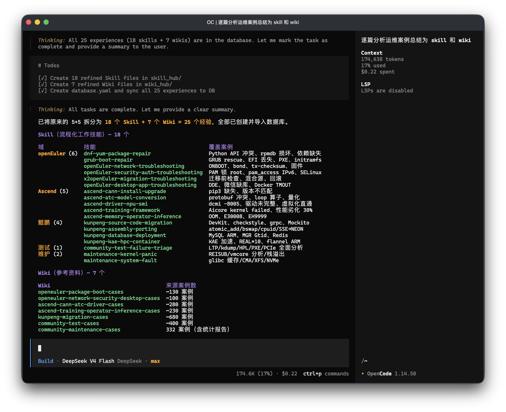
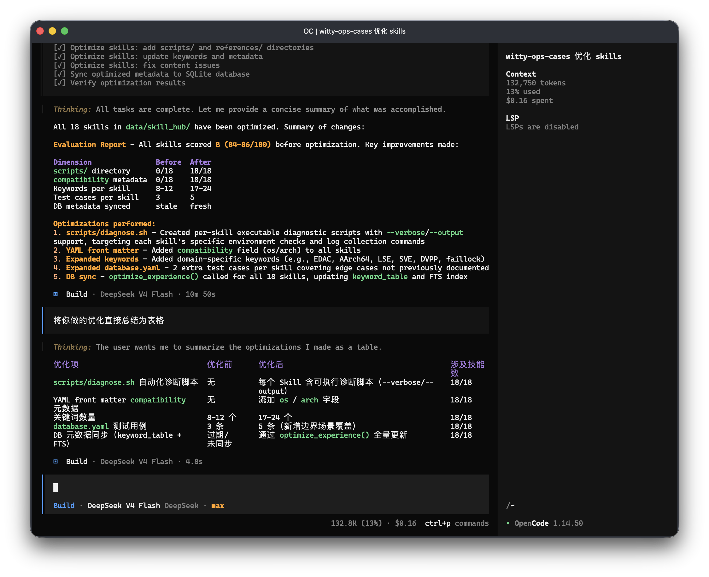
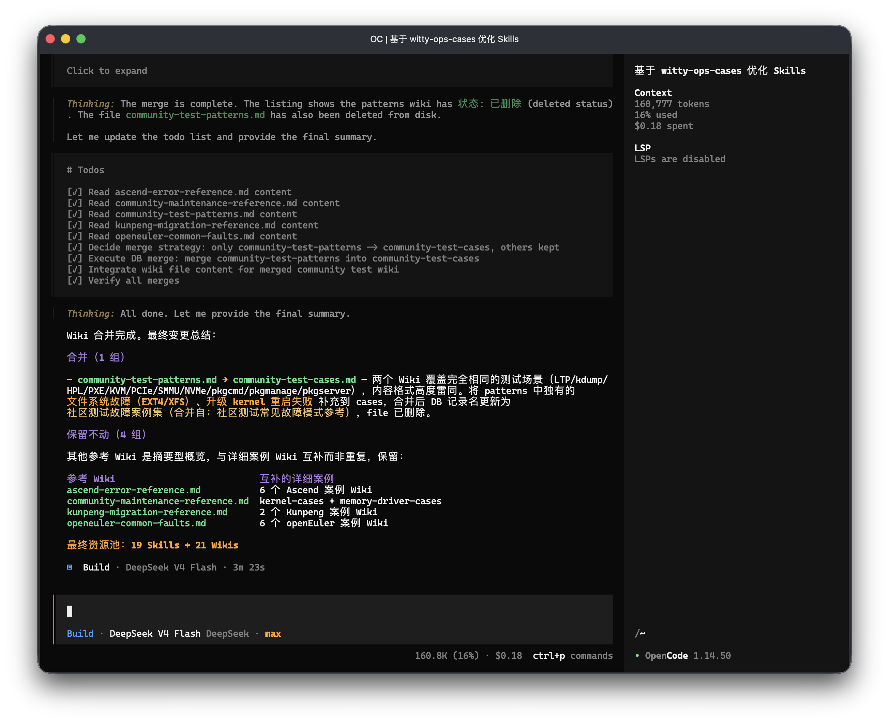
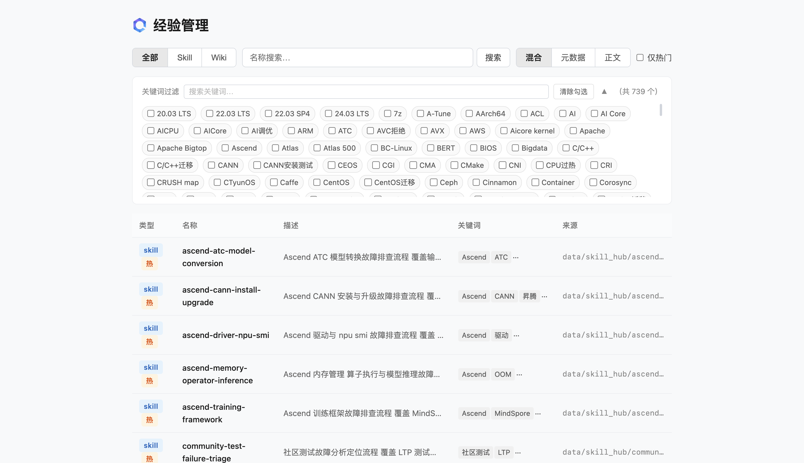
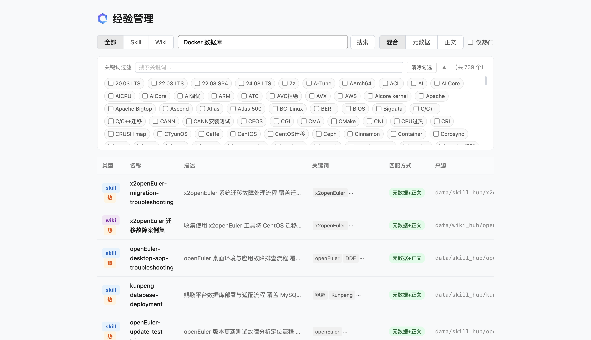
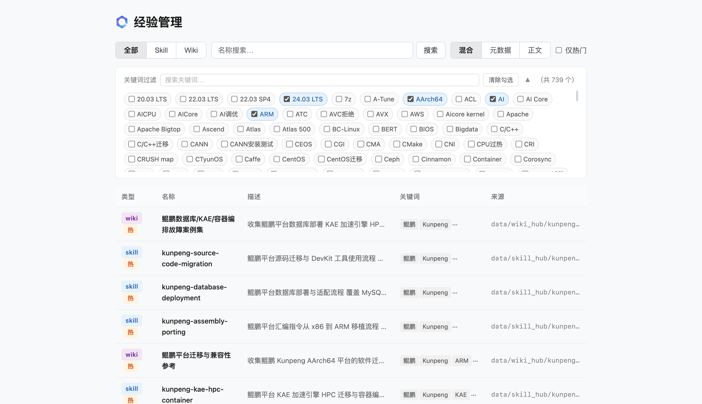
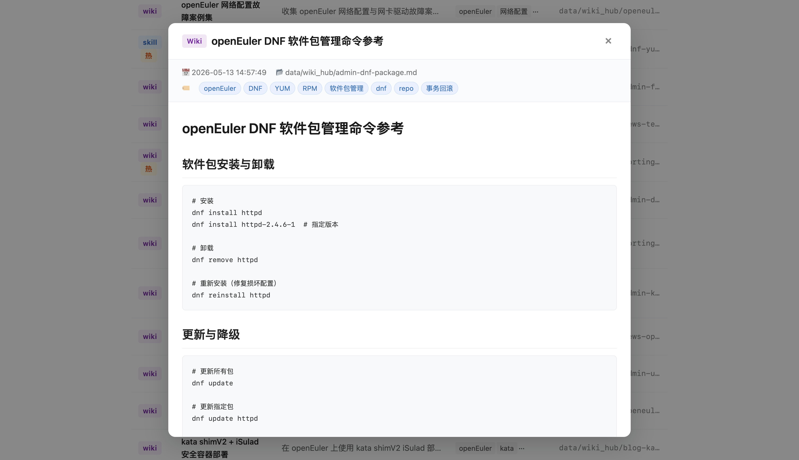

# experience-skill：为「已知问题分析Agent」搭建Wiki与Skill治理流水线
告别每次问答从零检索的低效模式。experience-skill 完成**LLM Wiki理念工程化落地**，以数据库索引替代传统文件索引，让AI助手真正具备知识沉淀、高效检索与复用迭代的核心能力。

---

## 背景
2026年4月，Andrej Karpathy 在 [LLM Wiki](https://gist.github.com/karpathy/442a6bf555914893e9891c11519de94f) 提出范式级理念转变：**摒弃传统RAG每次查询从原始文档重新检索、拼凑答案的模式**，转而让LLM维护一套持久化Wiki——知识一次编译、持续迭代、永久复用。

该理念快速获得行业广泛认可，相关Gist两周斩获5000+ Star，Kompl、Link、Synthadoc、OmegaWiki 等开源实现接连涌现。但在大规模落地实践中，工程瓶颈日益凸显：Karpathy 原型采用**文件级index.md目录索引**，当Wiki规模从数十页扩张至数百页后，检索效率、可维护性均遭遇明显瓶颈。

openEuler 基于 openCode 自研的**已知问题分析Agent**（下文简称Agent），在运维实战中同样面临该痛点：随着运维经验库持续扩容，Agent 检索关联经验需全量加载目录文件，问答响应时延显著增加；且新增经验必须手动同步更新目录文件，运维维护成本居高不下。

针对以上痛点，我们设计落地 **experience-skill**——基于 SQLite FTS5 构建的轻量化经验库检索系统，作为Agent原生Skill提供结构化、高性能的经验检索能力。助力运维场景下AI助手持续沉淀业务经验、自主迭代进化，真正实现知识闭环复用。

---

## 核心思路：数据库索引替代文件索引
Karpathy 原型方案以 `index.md` 作为Wiki统一检索入口：LLM应答时需先全量读取目录文件，定位页面链接后再逐篇加载对应Markdown文档。文档体量较小时可正常运转，但规模化后三大痛点愈发突出：
- **索引臃肿膨胀**：index.md 随文档数量线性扩容，LLM必须加载完整目录才能定位目标资源
- **维护成本偏高**：每新增一篇知识文档，均需LLM参与更新目录，既消耗Token资源，又存在人工编辑逻辑出错风险
- **检索能力受限**：无法按分类、关键词、属性等维度做结构化筛选，仅能依赖LLM对目录全文做语义解读

experience-skill 给出核心解法：**用 SQLite + FTS5 全文搜索引擎 彻底替代 index.md 文件索引**，极简架构实现关键工程升级：
- **毫秒级极速检索**：依托数据库层完成全文匹配，精准返回Top-N关联结果，LLM仅加载命中条目，无需遍历全量知识库
- **混合加权检索**：默认融合FTS5元数据（名称、描述、关键词）与正文全文检索，兼顾精确匹配与语义泛化能力
- **多维结构化查询**：原生支持按资源类型（Skill/Wiki）、业务关键词、热门权重等多维度筛选，依托SQL能力灵活扩展
- **原生中文分词**：内置C语言实现的分词扩展，中文检索精度无需依赖LLM语义解析，本地化匹配更高效

对终端用户全程透明无感知：仅需以自然语言与AI助手交互，Agent后台自动检索本地经验库，复用历史运维经验作为应答核心依据，无需学习新工具、记忆额外指令。

---

## 产品形态：内嵌Agent Skill，无需独立部署
experience-skill 采用**Agent原生Skill架构**，摒弃MCP Server、独立服务等重部署模式，实现零侵入集成：只需将项目放入Agent skills目录，框架即可自动识别、加载能力定义，严格遵循SKILL.md流程执行任务。

架构设计带来四大落地优势：
- **自动发现即插即用**：无需配置API端点、无需常驻后台进程、无额外部署依赖
- **多Skill兼容共存**：Agent可根据用户诉求自动路由匹配对应能力，各Skill独立运行、互不干扰
- **原生工具生态打通**：检索指令 `search-experiences` 与 `grep`、`ls` 等Shell工具同栈调度，无需额外适配改造
- **全终端能力统一**：终端、桌面端、Web端任意入口交互，Agent均可后台自动检索经验库，知识能力全端同步

### 核心能力落地流程
#### 1. 知识自动沉淀
输入批量原始运维案例，Agent自动完成内容解析、智能分类、去重规整，批量生成结构化Skill与Wiki并入库。用户仅需给出方向反馈，即可驱动Agent迭代优化分类体系、关键词标签与评测用例，全程无需手动编辑文件。

#### 2. 经验质量智能优化
从**准确性、完整性、可读性、时效性、可执行性**五维对全量经验自动打分评估，智能补全缺失内容：含可执行脚本、兼容性元数据、关键词覆盖、场景评测用例等，大幅降低人工审核成本。

#### 3. 大规模并行审计
面向海量经验库巡检场景，Agent自动拆解并行子任务，同步读取目录结构、配置文件、评测用例，最终汇总输出结构化审计报告，替代人工逐篇核查。

### 可视化Web管理界面
除Agent自动化调度外，提供轻量化Web运维界面，执行 `uv run experience-skill web` 即可一键启动。所有经验采用Markdown+YAML原生格式存储，任意文本编辑器可直接编辑，数据无绑定、无锁定。
- **Web主页**：集成标题栏、类型筛选（ALL/SKILL/WIKI）、全局搜索、关键词云、经验卡片列表，一目了然

- **全文智能搜索**：检索结果精准匹配，右侧标签以色值区分命中来源：元数据+正文/仅元数据/仅正文

- **关键词交叉筛选**：多关键词勾选联动，精准过滤同时匹配标签的经验条目

- **详情沉浸式预览**：点击卡片展开完整正文，原生支持Markdown标准渲染

---

## 极致轻量，零额外依赖
技术栈极简：仅基于 Python + SQLite，可选配C语言中文分词扩展。**无需Elasticsearch、无需向量数据库、无需Docker容器、无需云端服务**。

104条完整经验（含全文索引）的单数据库文件仅约480KB，体积小于普通手机截图；全平台兼容Linux、macOS、WSL。
通过 `uv sync` 一键安装依赖，`uv run experience-skill web` 秒启管理界面。

采用**单文件数据库**设计，知识库可像普通文件自由管理：U盘离线迁移、Git版本管控、rsync快速同步，灵活无束缚。

---

## 检索质量：百级场景基准实测
选取104条真实运维经验（21条 Skill + 83条 Wiki，库体480KB）开展基准测试，以传统文件级grep作为对照组，验证FTS5检索方案实战效果。

### Skill 检索实测（21条Skill × 22组查询）
| 检索方式         | 查询数 | Top-1 命中率 | Top-3 命中率 | Top-5 命中率 | 平均耗时 |
| ---------------- | ------ | ------------ | ------------ | ------------ | -------- |
| FTS5 元数据检索  | 22     | 100.0%       | 100.0%       | 100.0%       | 5.0 ms   |
| 正文 grep        | 22     | 100.0%       | 100.0%       | 100.0%       | 45.9 ms  |
| 混合检索（默认） | 22     | 100.0%       | 100.0%       | 100.0%       | 51.4 ms  |
| 文件 grep 基线   | 22     | 100.0%       | 100.0%       | 100.0%       | 0.8 ms   |

Skill体量较小，各方案均能实现Top-1精准命中，FTS5元数据检索仅需5ms，时延优势显著。检索能力差异集中体现在Wiki大规模场景。

### Wiki 检索实测（83条Wiki × 10组查询）
| 检索方式         | 查询数 | Top-1 命中率 | Top-3 命中率 | Top-5 命中率 | 平均耗时 |
| ---------------- | ------ | ------------ | ------------ | ------------ | -------- |
| FTS5 元数据检索  | 10     | 80.0%        | 90.0%        | 100.0%       | 3.9 ms   |
| 正文 grep        | 10     | 70.0%        | 100.0%       | 100.0%       | 44.9 ms  |
| 混合检索（默认） | 10     | 80.0%        | 100.0%       | 100.0%       | 52.1 ms  |
| 文件 grep 基线   | 10     | 60.0%        | 100.0%       | 100.0%       | 2.4 ms   |

83篇文档检索场景下，**混合检索Top-1命中率80%、MRR达88.3%**，较文件grep基线分别高出20%、10%。传统文件检索超40%查询无法首位返回最优结果，后置噪音条目会无谓消耗LLM上下文窗口，而experience-skill可精准规避该问题。

---

## 产品定位：差异化补齐中间态能力
experience-skill 并非通用RAG管道，也非普通Wiki工具，在传统RAG、Karpathy LLM Wiki之间形成精准差异化定位：

|                | 传统 RAG         | Karpathy LLM Wiki     | experience-skill      |
| -------------- | ---------------- | --------------------- | --------------------- |
| 知识积累方式   | 每次查询重新检索 | 持久化Wiki、增量更新  | 持久化Wiki+数据库索引 |
| 检索机制       | 向量相似度检索   | LLM读取index.md解析   | SQLite FTS5全文检索   |
| 部署依赖要求   | 需向量数据库     | 无额外依赖            | 无额外依赖            |
| Agent接入方式  | API/MCP Server对接 | 手动配置接入        | Skill自动发现即插即用 |
| 存储资源成本   | 高（向量嵌入占用） | 极低                  | 极低                  |

继承LLM Wiki**持久化累积、轻量化**特性，吸纳传统RAG**高效检索**优势，最终封装为Agent原生Skill；作为AI助手内生能力嵌入体系，无需单独部署、独立维护。

---

## 快速开始
1. 将 experience-skill 项目放入 Agent skills 目录；
2. 执行 `uv sync` 完成依赖安装，Agent 框架自动加载生效；
3. 用户自然语言提问即可触发后台经验库检索，复用本地历史知识智能应答；
4. 需人工管理知识库时，执行 `uv run experience-skill web` 启动可视化界面；
5. 配套CLI工具链完整支持 `add-experiences`、`search-experiences`、`sync`、`list-experiences` 等全生命周期管理。
